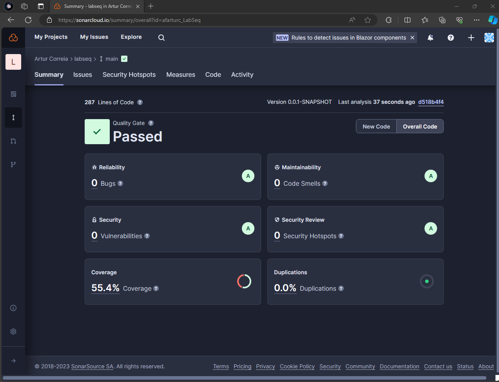

# LabSeq - Altice Labs Exercise 2023

This project aims to create a REST service with Spring Boot to implement labseq sequence.

## Table of Contents

- [Labseq Sequence](#labseq-sequence)
- [Implementation](#implementation)
- [Results](#results)
- [How to run](#how-to-run)

## Labseq Sequence

```
The labseq – l(n) - sequence is defined as follows:
n=0 => l(0) = 0
n=1 => l(1) = 1
n=2 => l(2) = 0
n=3 => l(3) = 1
n>3 => l(n) = l(n-4) + l(n-3)
Example of the first sequence values:
0
1
0
1
1
1
1
2
2
2
3
[…]
```

The Labseq sequence is similar to the Fibonacci sequence, so the first step was to search for previous work. Three approaches were found: recursive, memoization, and iterative. These were tested in a small Java program based on the article, [How to Write a Java Program to Get the Fibonacci Series](https://www.freecodecamp.org/news/how-to-write-a-java-program-to-find-the-fibonacci-series/). The recursive approach had a significant time complexity and there was a stack overflow for larger values of n. The memoization approach was faster since the cache helped with the time complexity, but it still suffered from the same error. The iterative approach did not have the stack overflow error, but the memory was still constrained and not suitable for the problem's required cache. Although none of the methods were 100% efficient, the memoization approach performed the best, with only the stack overflow problem to solve. A divide-and-conquer approach was used to solve this problem. For every n greater than 7000 in the recursion, it would calculate n/2, thus saving intermediate values in the cache. This way, when calculating larger values of n, it would already have intermediate calculations and the stack would be smaller.

## Implementation

The Rest service was implemented using Spring framework, specifically Spring Boot, due to prior knowledge of the technology. The development process followed a TDD approach where tests were implemented first and the service was built based on them. Furthermore, there was implemented a CI pipeline for static code analysis using SonarCloud, this helped identify code smells, bugs and duplicated code and fix them. The process began with basic unit tests for the controller and service, followed by integration tests for the complete API. The API contained only two endpoints - one for calculating the labseq sequence and the other for retrieving useful cache status. The cache was a simple object class with a HashMap and stat information, as it only required the index n key and the value. To enhance the project, a key-value database with high performance like Redis could have been used. Open API format was used for documentation as required, with the help of Springdoc swagger 3 maven dependency. Finally, a simple Dockerfile was created to containerize the application for easy distribution.


## Results

The memoization combined with a divide-and-conquer approach proved to be highly efficient. For instance, when dealing with values such as n = 10000, the calculation time was less than one second.


The code analysis also showcases good code coverage (even though full coverage is 55% the service implemented has a coverage of 93%), with zero bugs and code smells detected, since everything was fixed during development.




## How to run

The application can run in a Docker Container or Locally.

### Docker Container

The user must make sure that has [Docker](https://www.docker.com/products/docker-desktop/) installed.

```
cd labseq
docker build -t labseq .
docker run -d -p 8080:8080 labseq
```

### Locally

To run locally the user must have [JDK 21](https://www.oracle.com/java/technologies/downloads/) and [Maven](https://maven.apache.org/) installed.

```
cd labseq
.\mvnw spring-boot:run
```

### Links

After starting the application by either method, the user can access it using the following links:

REST API
- http://localhost:8080/labseq

Swagger Documentation
- http://localhost:8080/swagger-ui/index.html
